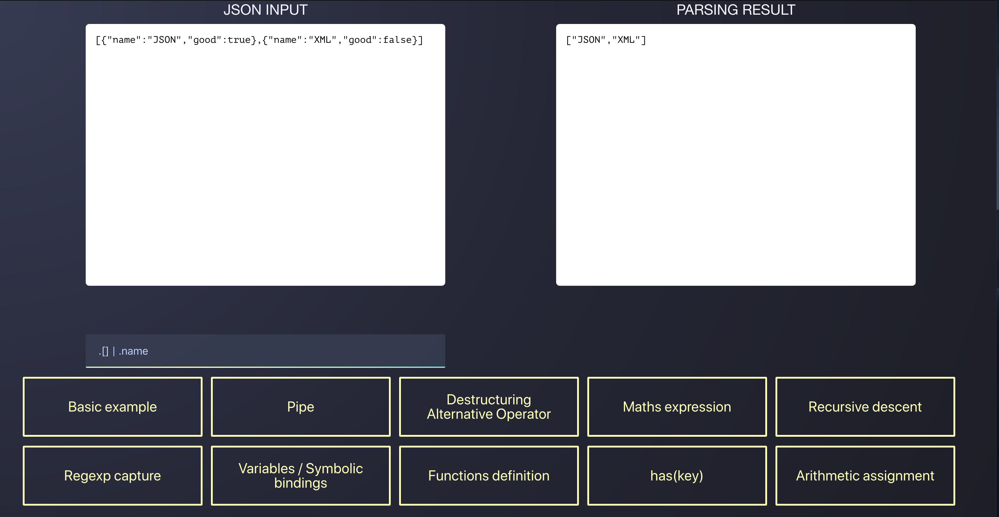

# jq-wasm
Run the [jq](https://github.com/stedolan/jq) command-line JSON processor in your browser with [Web Assembly](https://webassembly.org/) 👊



# prerequisites

- Docker >= 1.11
- npm >= 5.x.x
- go >= 1.10 (optional)

# Getting started

Be sure to have docker install on you machine

1 - Bootstrap the environment
```
make all
```

2 (Optional) - Compile go sample go server (binaries are already included in dist)
```
cd server && make all
```

3 - Run the server (depending on your distro)

- For linux user:
```bash
make run-server-linux
```

- For mac user:
```bash
make run-server-darwin
```

5 - Check result on http://localhost:8100/

# FAQ

## What is WebAssembly ? 

> WebAssembly (abbreviated Wasm) is a binary instruction format for a stack-based virtual machine. Wasm is designed as a portable target for compilation of high-level languages like C/C++/Rust, enabling deployment on the web for client and server applications.

WebAssembly is efficient, fast, safe, and a lot more. Get more info on [here](https://webassembly.org/).

## But why doing this ?


In this use case, we wanted to parse some json expression by using the famous [jq](https://github.com/stedolan/jq) syntax.
But, as you may know, this tool is written in C, so we have two options:
- rewrite a parser library that will try to mimic the jq behavior, will we get the same functionalities? The same performance? 
- find a way to use the native code, in order to leverage the existing library, a native speed execution (guess what we choose 😛)

## So, what's in the bag?

So, the main idea is to compile the existing code to the wasm format, and then loading it in the browser. Simple, no?

To compile our code to the wasm format, we have serveral options:
- directly use the [LLVM](http://llvm.org/) toolchain (TL;DR **HARD**)
- or use [emscripten](https://emscripten.org/), initially known to be a C to [asm.js](http://asmjs.org/) compiler, he can now target Wasm, and leverage LLVM internally (TL;DR **TAKE THIS**)

[To be continued]

